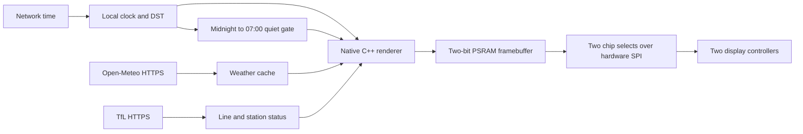

# ESP32-S3 e-paper clock & weather

A wide, quiet dashboard that runs entirely on an **ESP32-S3** and a **Waveshare 10.85-inch four-colour e-Paper HAT+ (G)**. No Raspberry Pi, browser renderer or server is needed: the ESP32 draws the screen, fetches weather over Wi-Fi, and keeps time with NTP, and shows two TfL journey indicators.


*Generated by the same C++ renderer used on the ESP32. This preview uses labelled sample data; deployed firmware uses live data.*

## What you get

- A huge single-row clock with date and automatic daylight-saving time.
- Current temperature, weather condition, and wind direction/speed.
- Eight hourly forecasts with **temperature / rain probability** beneath larger weather icons.
- A changed-digit clock update every minute, with a normal full refresh and fresh weather every ten minutes.
- A sleeping-squirrel screen from midnight to 07:00 London time, with display and weather/TfL updates paused. [Night mode →](docs/NIGHT_MODE.md)
- Weather-independent clock startup and a validated last-good forecast saved across restarts.
- Two compact journey indicators: **East India / DLR** and **Canning Town / Jubilee**, combining line and station status.
- Native yellow sunshine, yellow 40–50% rain highlights and red highlights above 50%; yellow station notices and red disruptions.
- Detailed TfL status/reasons, upcoming notices, and separate weather/line/station freshness and retries.
- Feels-like temperature, gusts and the next hourly rain-risk window in the footer.
- Settings over USB or a temporary password-protected phone setup page; authenticated, SHA-256-verified OTA with boot rollback.
- Optional DS3231 offline time, MAX17048 battery voltage/state-of-charge, and Home Assistant temperature/note entities.
- Battery power management: batched radio sessions, 80 MHz idle CPU, light sleep between updates and during BUSY, and overnight deep sleep. [Power evidence and battery estimates →](docs/POWER.md)
- Hidden-password Wi-Fi setup over USB; credentials stay on the ESP32.
- A desktop preview using the actual firmware renderer.

**Measured on the tested hardware:** normal full refresh ≈ **17 seconds**; fixed-120-Hz clock-window refresh ≈ **5.27 seconds**. The partial window limits the visible area that updates; it does not make the waveform instantaneous.

## Hardware

| Part | Tested configuration |
|---|---|
| Microcontroller | UICPAL ESP32-S3-N16R8, 16 MB flash, 8 MB OPI PSRAM |
| Display | Waveshare 10.85-inch HAT+ **(G)**, 1360 × 480, black/white/red/yellow |
| Display controller | Two JD79665AA controllers, 680 × 480 each |
| USB connection | Native **USB-OTG**, one cable |
| Network | 2.4 GHz Wi-Fi with internet access |

Use this exact four-colour panel profile. The monochrome 10.85-inch model has different commands and waveforms. GPIO numbers below are the printed GPIO labels, not header positions.

| HAT lead | ESP32 |
|---|---|
| VCC | 3V3 |
| GND | GND |
| DIN | GPIO11 |
| CLK | GPIO12 |
| CS_M | GPIO10 |
| CS_S | GPIO9 |
| DC | GPIO13 |
| RST | GPIO14 |
| BUSY | GPIO4 |
| PWR | GPIO5 |


*Actual hardware photo from the initial four-colour wiring test. It shows the bring-up pattern, not the final dashboard.*

## Quick start

The scripts support macOS and Linux. You need Git, Python 3 with `venv`, a C/C++ toolchain, `curl` and `tar`. On macOS, install the Xcode Command Line Tools first. Windows users can use [the Arduino IDE instructions](docs/SETUP.md#arduino-ide).

```bash
git clone https://github.com/alex-kharlamov/esp32-s3-epaper-dashboard.git
cd esp32-s3-epaper-dashboard
./scripts/setup.sh
```

Edit [Configuration.h](ESP32S3_Dashboard/Configuration.h) for your coordinates, location label and POSIX timezone rule. Public defaults point to central London; Wi-Fi credentials are never put in that file.

```bash
./scripts/build.sh
# Find your actual serial port; macOS example below.
./scripts/upload.sh /dev/cu.usbmodem2101
./scripts/wifi.sh /dev/cu.usbmodem2101
```

Enter the SSID and password in the local prompt. The password is hidden. Wait for `WIFI configuration saved; connecting.` Close any other serial monitor before setup.

```bash
./scripts/monitor.sh /dev/cu.usbmodem2101 --seconds 430 --refresh-count 3
```

The firmware waits **180 seconds after boot** before driving the panel. Its first update is a full refresh. The clock-window schedule starts after that. Opening native USB serial can reset this board, so reconnecting a monitor may restart the cooldown.

[Detailed setup and troubleshooting →](docs/SETUP.md)

## How it works



The renderer packs four pixels into each byte. A **163,200-byte framebuffer** lives in PSRAM; glyphs and weather icons live in flash. The image is split across the display's two controllers. Hardware SPI sends buffered 170-byte rows at 4 MHz; selected refresh windows still require the complete framebuffer to be transferred.

Every minute the firmware compares `HH:MM` with the last successfully displayed time and selects only changed digit groups. It renders the dashboard in memory, initializes the vendor fast waveform at a fixed 120 Hz frame rate, then transfers the selected regions using the controller's **`0x83` partial-window register**. Adjacent changed digits share a window. Separate hour/minute groups use separate waveform passes, preserving the colon and unchanged digits. The weather, date and forecast remain visually unchanged. After BUSY releases, the firmware sends sleep commands and drives PWR LOW.

Weather is fetched every ten minutes by a background task, independently of rendering. Versioned, checksummed NVS snapshots restore the last good weather after a restart; upcoming forecasts are selected by their original UTC timestamps, with expired slots left unavailable. The clock can start even if weather has never arrived, and a cold boot without valid time shows `TIME WAITING`. Cached weather keeps its original timestamp and an explicit cached/stale label.

The background task fetches TfL alongside weather in one ten-minute batch. Two indicators combine line-wide service with the relevant station: East India / DLR and Canning Town / Jubilee (Underground notices only). Weather and transport are displayed together on the scheduled ten-minute full refresh; ordinary minute updates change only clock digits. Unavailable or stale transport data is labelled at the next full refresh. The explicit USB repaint diagnostic remains available. [Offline behavior, indicator meanings and tests →](docs/OFFLINE_TRANSPORT.md) [Compact colour layout and partial updates →](docs/COMPACT_COLOUR.md)

Weather comes from [Open-Meteo](https://open-meteo.com/). NTP synchronizes time during each ten-minute network batch, and a POSIX timezone rule handles daylight saving. Clock updates are aligned to wall-clock minute boundaries, with measured refresh latency used to start the upcoming minute’s image early so it settles near the boundary. HTTPS verifies certificates and hostnames using the ESP32's built-in CA bundle. Wi-Fi credentials are stored in NVS on the board, which is **not encrypted at rest** in this development build.

From midnight to 07:00 London time, a generated sleeping-squirrel illustration replaces the dashboard. The screen is drawn once, then display and weather/TfL updates pause until morning. On battery/charger power, the ESP32 deep-sleeps until 06:55, synchronizes time before 07:00, then restores the dashboard. With an active USB debug host, chip sleep is suppressed to preserve the console. [Night mode and preview →](docs/NIGHT_MODE.md)

[Refresh commands, timing evidence and limitations →](docs/REFRESH.md)

Examples: `12:34 → 12:35` refreshes only the last minute digit; `12:39 → 12:40` refreshes both minute digits; `09:59 → 10:00` uses separate hour and minute windows. If the time is unchanged, no minute refresh is sent. A ten-minute full refresh still updates the complete dashboard.

The faster clock mode produced **small coloured residue** in the physical test, accepted by the tester. Set `DASH_CLOCK_PLL=0x08` to return to the cleaner vendor dynamic mode (about 12.1 seconds). A two-second mode has not been established; see [the GxEPD2 comparison and speed experiment](docs/SPEED_RESEARCH.md).

## Configuration and preview

[Configuration.h](ESP32S3_Dashboard/Configuration.h) controls location, timezone, refresh intervals, window mode, clock frame rate and Wi-Fi transmit power. A tested **8.5 dBm** limit resolved repeated association failures on our board; it is a board-specific workaround, not a universal optimum.

```bash
./tools/preview.sh
# Result: build/preview/dashboard.png
```

Fonts and icons are already generated, so a firmware build does not require asset conversion. To rebuild the generated bitmaps after editing assets:

```bash
.tools/venv/bin/python tools/generate_assets.py
.tools/venv/bin/python tools/generate_sleep_asset.py
./tools/preview.sh
```

## Validation and scope

Compiled with Espressif Arduino **3.3.12** and ArduinoJson **7.4.2**. Public and deployment builds, renderer buffer guards, all 1,440 changed-digit minute transitions, cache/transport fixtures, NTP-correction regressions and night/DST boundary tests passed.

On the device, consecutive clock updates advanced without rollback; the last measured completion was 10 ms after the NTP minute boundary. A 90-second quiet-mode preview held the illustrated screen without intermediate display/data updates, then restarted fetching and restored the dashboard. See [stable-clock validation](docs/stable-clock-validation.json), [night-mode validation](docs/night-mode-validation.json), and [ten-minute data validation](docs/ten-minute-data-validation.json). Additional power tests verified a 991 ms light-sleep probe with zero errors and a 90-second deep-sleep timer wake, retained panel cooldown and dashboard restoration. The user confirmed that the physical clock kept advancing during a bounded battery-profile test despite USB logging disappearing. See [power validation](docs/POWER.md). A full overnight run remains untested.

Waveshare does not advertise partial refresh for this panel, although its controller manual documents the window used here. This is a tested prototype, not a vendor-qualified operating mode. The minute cadence is outside Waveshare's general 180-second refresh guidance. Long-term ghosting and panel lifetime have not been established; a full overnight run remains outstanding.

## Credits and licensing

The first renderer and the existing weather icons came from [czuryk/Waveshare-ePaper-10.85-dashboard](https://github.com/czuryk/Waveshare-ePaper-10.85-dashboard). The current compact layout follows a selected AI-generated concept and uses [Oxanium](https://github.com/google/fonts/tree/main/ofl/oxanium), with its SIL Open Font License included in `assets/Oxanium-OFL.txt`. The display driver comes from [Waveshare's exact-model example](https://github.com/waveshareteam/e-Paper/tree/master/E-paper_Separate_Program/10.85inch_e-Paper_G). This project renders live services in native ESP32 code and adds the verified dual-controller clock window.

Original integration code is MIT licensed. Third-party fonts, icons, generated asset bitmaps and upstream-derived UI elements are **not relicensed by this repository**. See [LICENSE](LICENSE) and [NOTICE.md](NOTICE.md) for component provenance and the upstream licensing limits.

## v21 operation and optional hardware

[All ten improvements and their validation status →](docs/IMPROVEMENTS.md)

The clock remains one-minute and weather/TfL remain ten-minute by default. Normal providers share a single ten-minute batch deadline. Each provider has independent success timestamps and failure backoff. TfL line/station failures do not invalidate successful weather, and weather failures do not invalidate TfL. Full refreshes coordinate with completed data work; a failed batch retains honest old/unknown labels. The clock continues while a data batch is pending. Current weather older than two hours is hidden, while still-valid forecast slots remain usable. Model observation time and download time are retained separately.

TfL reasons are bounded and shown below the two existing indicators. Upcoming notices within seven days are shown with their start time when present in the response. This does not add an arrivals countdown or increase normal transport polling. Cached transport after restart is always OLD until revalidated.

Settings, hardware wiring and OTA instructions are in [SETUP.md](docs/SETUP.md#runtime-configuration-and-maintenance-v21). RTC and fuel-gauge support are disabled until enabled in settings; absent devices produce unavailable readings. Home Assistant requires an explicitly configured HTTPS endpoint/token and optional temperature/note entity IDs. No external account is contacted unless configured.

A recoverable BUSY/SPI fault shuts down the panel, records a diagnostic, waits three minutes and restarts. Two recovery attempts are allowed; repeated faults park with the panel off and USB maintenance available. Thirty minutes of successful runtime clears the consecutive-fault count. OTA images remain pending until a dashboard render completes successfully; the Arduino core's immediate acceptance is deferred so bootloader rollback remains active. Normal operation does not run the setup access point or OTA server.

Local tests include legacy cache migration, independent provider failures, settings bounds/timezone parsing, bounded/chunked HTTP responses, hardware-register decoding and existing display-window regression suites. CI builds firmware, runs tests and packages an application-only OTA image with a SHA-256 checksum. Physical RTC/fuel-gauge, configured Home Assistant, phone-portal interaction and OTA upload/rollback need their corresponding hardware/service/client for end-to-end validation. The extended overnight/ghosting/current-measurement limits still apply.
