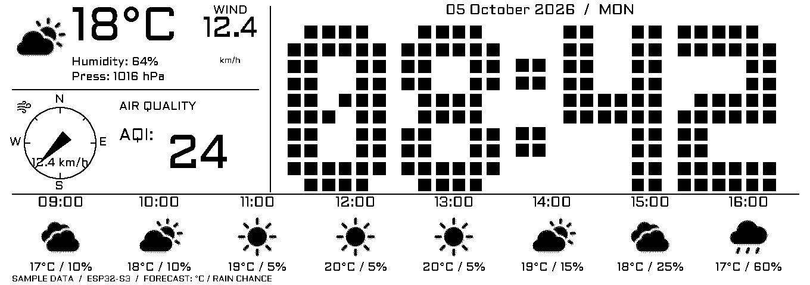
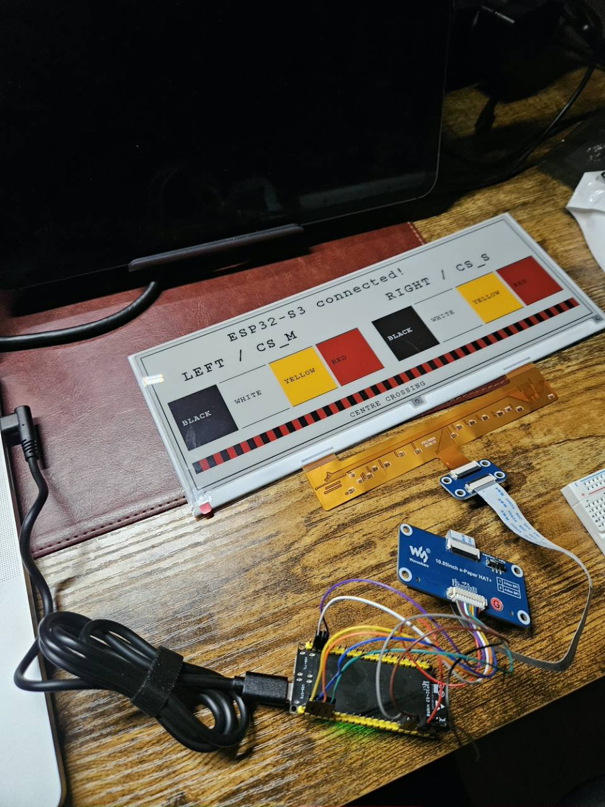
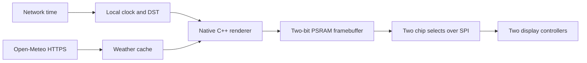

# ESP32-S3 e-paper clock & weather

A wide, quiet dashboard that runs entirely on an **ESP32-S3** and a **Waveshare 10.85-inch four-colour e-Paper HAT+ (G)**. No Raspberry Pi, browser renderer or server is needed: the ESP32 draws the screen, fetches weather over Wi-Fi, and keeps time with NTP.



*Generated by the same C++ renderer used on the ESP32. This preview uses labelled sample data; deployed firmware uses live data.*

## What you get

- A huge single-row clock with date and automatic daylight-saving time.
- Current temperature, humidity, pressure, wind speed and US AQI.
- Eight hourly forecasts with **temperature / rain probability** beneath larger weather icons.
- A clock-region update every minute, with a normal full refresh and fresh weather every ten minutes.
- Hidden-password Wi-Fi setup over USB; credentials stay on the ESP32.
- A desktop preview using the actual firmware renderer.

**Measured on the tested hardware:** normal full refresh ≈ **17 seconds**; fast clock-window refresh ≈ **12.1 seconds**. The partial window limits the visible area that updates; it does not make the waveform instantaneous.

## Hardware

| Part | Tested configuration |
|---|---|
| Microcontroller | UICPAL ESP32-S3-N16R8, 16 MB flash, 8 MB OPI PSRAM |
| Display | Waveshare 10.85-inch HAT+ **(G)**, 1360 × 480, black/white/red/yellow |
| Display controller | Two JD79665AA controllers, 680 × 480 each |
| USB connection | Native **USB-OTG**, one cable |
| Network | 2.4 GHz Wi-Fi with internet access |

Use this exact four-colour panel profile. The monochrome 10.85-inch model has different commands and waveforms. GPIO numbers below are the printed GPIO labels, not header positions.

| HAT lead | ESP32 |
|---|---|
| VCC | 3V3 |
| GND | GND |
| DIN | GPIO11 |
| CLK | GPIO12 |
| CS_M | GPIO10 |
| CS_S | GPIO9 |
| DC | GPIO13 |
| RST | GPIO14 |
| BUSY | GPIO4 |
| PWR | GPIO5 |



*Actual hardware photo from the initial four-colour wiring test. It shows the bring-up pattern, not the final dashboard.*

## Quick start

The scripts support macOS and Linux. You need Git, Python 3 with `venv`, a C/C++ toolchain, `curl` and `tar`. On macOS, install the Xcode Command Line Tools first. Windows users can use [the Arduino IDE instructions](docs/SETUP.md#arduino-ide).

```bash
git clone https://github.com/alex-kharlamov/esp32-s3-epaper-dashboard.git
cd esp32-s3-epaper-dashboard
./scripts/setup.sh
```

Edit [Configuration.h](ESP32S3_Dashboard/Configuration.h) for your coordinates, location label and POSIX timezone rule. Public defaults point to central London; Wi-Fi credentials are never put in that file.

```bash
./scripts/build.sh
# Find your actual serial port; macOS example below.
./scripts/upload.sh /dev/cu.usbmodem2101
./scripts/wifi.sh /dev/cu.usbmodem2101
```

Enter the SSID and password in the local prompt. The password is hidden. Wait for `WIFI configuration saved; connecting.` Close any other serial monitor before setup.

```bash
./scripts/monitor.sh /dev/cu.usbmodem2101 --seconds 430 --refresh-count 3
```

The firmware waits **180 seconds after boot** before driving the panel. Its first update is a full refresh. The clock-window schedule starts after that. Opening native USB serial can reset this board, so reconnecting a monitor may restart the cooldown.

[Detailed setup and troubleshooting →](docs/SETUP.md)

## How it works



The renderer packs four pixels into each byte. A **163,200-byte framebuffer** lives in PSRAM; glyphs and weather icons live in flash. The image is split across the display's two controllers.

Every minute the firmware renders the current clock with cached weather, initializes the vendor fast waveform, transfers the frame, then selects the clock rectangle with the controller's **`0x83` partial-window register**. Both halves receive their own window. The weather, date and forecast remain visually unchanged. After BUSY releases, the firmware sends sleep commands and drives PWR LOW.

Every ten minutes it fetches fresh weather and uses the normal full-screen waveform. The clock window includes only the digits; the date header updates with the full screen, including at midnight. Cached weather is retained if a request fails, with fetch time and a stale-data label on the next full refresh. Missing AQI is shown as `--`.

Weather and modelled air quality come from [Open-Meteo](https://open-meteo.com/). NTP synchronizes time, and a POSIX timezone rule handles daylight saving. HTTPS verifies certificates and hostnames using the ESP32's built-in CA bundle. Wi-Fi credentials are stored in NVS on the board, which is **not encrypted at rest** in this development build.

[Refresh commands, timing evidence and limitations →](docs/REFRESH.md)

## Configuration and preview

[Configuration.h](ESP32S3_Dashboard/Configuration.h) controls location, timezone, refresh intervals, window mode and Wi-Fi transmit power. A tested **8.5 dBm** limit resolved repeated association failures on our board; it is a board-specific workaround, not a universal optimum.

```bash
./tools/preview.sh
# Result: build/preview/dashboard.png
```

Fonts and icons are already generated, so a firmware build does not require asset conversion. To rebuild the generated bitmaps after editing assets:

```bash
.tools/venv/bin/python tools/generate_assets.py
./tools/preview.sh
```

## Validation and scope

Compiled with Espressif Arduino **3.3.12** and ArduinoJson **7.4.2**. The renderer's buffer guards passed. On the physical panel, one normal full refresh and two consecutive clock-window refreshes completed, and the user confirmed the weather, date and forecasts stayed still. See [the captured timings](docs/validation.json).

Waveshare does not advertise partial refresh for this panel, although its controller manual documents the window used here. This is a tested prototype, not a vendor-qualified operating mode. The minute cadence is outside Waveshare's general 180-second refresh guidance. Long-term ghosting and panel lifetime have not been established; the ten-minute full-repeat schedule is configured but was not captured in the short validation run.

## Credits and licensing

The visual direction, fonts and icons come from [czuryk/Waveshare-ePaper-10.85-dashboard](https://github.com/czuryk/Waveshare-ePaper-10.85-dashboard). The display driver comes from [Waveshare's exact-model example](https://github.com/waveshareteam/e-Paper/tree/master/E-paper_Separate_Program/10.85inch_e-Paper_G). This project ports rendering and live services to native ESP32 code and adds the verified dual-controller clock window.

Original integration code is MIT licensed. Third-party fonts, icons, generated asset bitmaps and upstream-derived UI elements are **not relicensed by this repository**. See [LICENSE](LICENSE) and [NOTICE.md](NOTICE.md) for component provenance and the upstream licensing limits.
