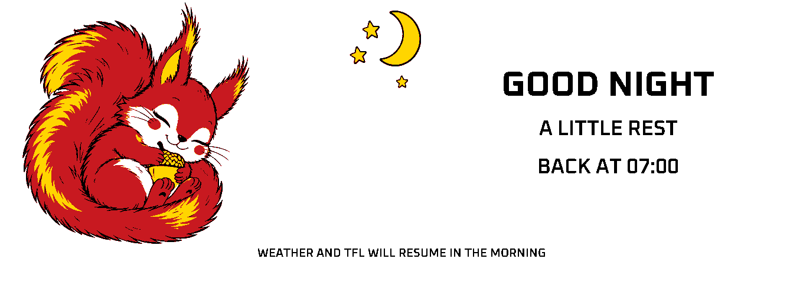

# Night quiet mode

From 00:00 inclusive until 07:00 exclusive in London civil time, the firmware paints one sleeping-squirrel image using a normal full-colour refresh. It then leaves the panel asleep with PWR LOW. No minute-clock, transport-strip, or periodic full redraw runs during the quiet period.

The background worker pauses weather and TfL requests; requests that finish across midnight are discarded before publishing new state. Automatic Wi-Fi reconnect attempts pause too. At 07:00 it starts an immediate new weather/TfL batch and restores the dashboard with a full redraw. If networking is unavailable, existing honest cached/stale labels apply. New results appear on the scheduled full redraw, as during daytime operation.

This is a quiet application mode, not ESP32 deep sleep. NTP and the system clock remain active, preserving precise time for morning wake-up. The POSIX London timezone rule handles summer time and both DST transitions. When time is unknown, the firmware keeps the existing time-waiting behavior instead of guessing whether it is night. A night-time reboot observes the existing 180-second panel startup cooldown, then paints the sleep screen once.

For a daytime USB diagnostic, send `SLEEP PREVIEW` followed by a newline. It uses the same display/data gate for 90 seconds, without changing NTP/system time, and then automatically restores the dashboard. If it is actually night, the real quiet schedule continues after the preview expires.

Host tests cover the exact midnight/07:00 second boundaries, winter/summer time, both DST transition days, repeated quiet-loop calls, one-shot sleep/wake transitions and renderer buffer guards.

The squirrel illustration was made with the built-in image-generation tool. Its original PNG and prompt are preserved in `assets/sleep-squirrel-source.png` and `assets/sleep-artwork-prompt.txt`. Rebuild its native 73,920-byte bitmap with `python tools/generate_sleep_asset.py` (Pillow required). The compiler uses only black, white, yellow and red pigment codes, with no dithering; the selected source artwork is packed into flash, then copied into the framebuffer for the one nightly normal-colour refresh. Firmware text stays rendered with the project's fonts.
